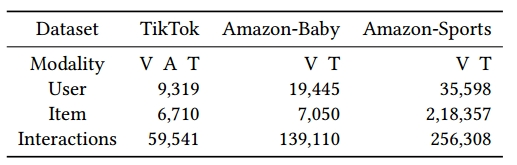
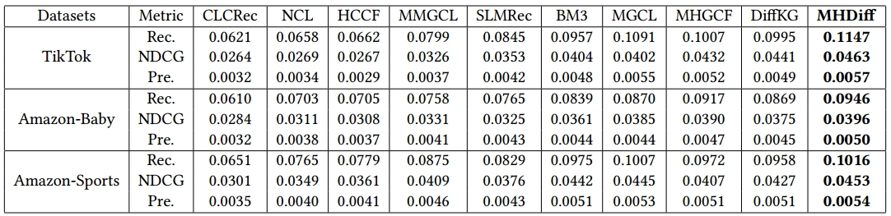

# MHDiff: Multimodal Hierarchical Graph Contrastive Learning with Diffusion-Enhanced for Multimedia-based Recommendation


## 📝 Environment

We develop our codes in the following environment:

- CUDA==12.1
- python==3.9.21
- torch==2.3.1
- numpy==2.0.2
- scipy==1.13.1

## 📚 Datasets



## 🚀 How to run the codes

The command lines to train MHDiff on the three datasets are as below. The un-specified hyperparameters in the commands are set as default.

**! Before running codes on baby  or sports dataset, please unzip image_feat.zip** 

- TikTok

```python
python Main.py --data tiktok --reg 1e-4 --trans 1 --cl_method 1 --steps 50 --temp 0.1
```

- Baby

```python
python Main.py --data baby --ssl_reg 1e-1 --keepRate 1 --epoch 100 --gnn_layer 2
```

- Sports

```python
python Main.py --data sports --reg 1e-6 --temp 0.3 --ris_lambda 0.1 --e_loss 0.01 --keepRate 1 --trans 1 --epoch 130 --cl_method 1 --rebuild_k 4
```

## 👉 Code Structure

```
.
├── README.md
├── Main.py
├── Model.py
├── Params.py
├── DataHandler.py
├── Utils
│   ├── TimeLogger.py
│   └── Utils.py
|── Datasets
|   ├── tiktok
|   │   ├── trnMat.pkl
|   │   ├── tstMat.pkl
|   │   ├── valMat.pkl
|   │   ├── audio_feat.npy
|   │   ├── audio_id.npy
|   │   ├── image_feat.npy
|   │   ├── image_id.npy
|   │   ├── text_feat.npy
|   │   └── text_id.npy
|   ├── baby
|   └── sports
├── MHDiff.png
└── performance.png
```


## 🎯 Experimental Results

Performance comparison of baselines on different datasets in terms of Recall@20, NDCG@20 and Precision@20:



## Acknowledgements

We are particularly grateful to the authors of [DiffMM](https://arxiv.org/abs/2406.11781), as parts of our code implementation were derived from their work. We have cited the relevant references in our paper.